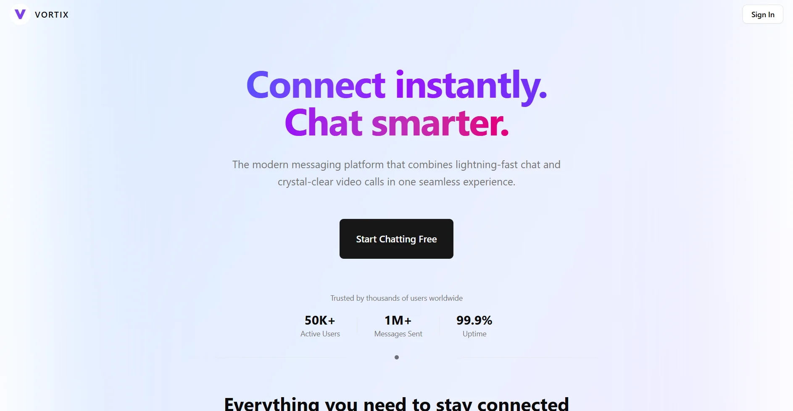

# Vortix



> The modern messaging platform that combines lightning-fast chat and crystal-clear video calls in one seamless experience.

## Features

- **Real-time Messaging** — Instant chat powered by Stream Chat SDK
- **HD Video Calls** — Crystal-clear video conferencing via Stream Video SDK
- **Authentication** — Secure sign-in and user management with Clerk
- **User Search** — Find and connect with other users instantly
- **Responsive Design** — Works seamlessly on desktop and mobile
- **Real-time Backend** — Live data sync powered by Convex

## Tech Stack

| Layer | Technology |
|---|---|
| Framework | Next.js 16 (App Router) |
| Language | TypeScript |
| Auth | Clerk |
| Backend / DB | Convex |
| Chat | Stream Chat React SDK |
| Video | Stream Video React SDK |
| Styling | Tailwind CSS v4 |
| UI Primitives | Radix UI |
| Icons | Lucide React |

## Getting Started

### Prerequisites

- Node.js 18+
- A [Clerk](https://clerk.com) account
- A [Convex](https://convex.dev) account
- A [Stream](https://getstream.io) account

### Installation

1. Clone the repository:

```bash
git clone https://github.com/JulianCeleita/vortix.git
cd vortix
```

2. Install dependencies:

```bash
npm install
```

3. Set up environment variables — create a `.env.local` file in the root:

```env
# Clerk
NEXT_PUBLIC_CLERK_PUBLISHABLE_KEY=pk_...
CLERK_SECRET_KEY=sk_...
CLERK_JWT_ISSUER_DOMAIN=https://...

# Convex
CONVEX_DEPLOYMENT=dev:...
NEXT_PUBLIC_CONVEX_URL=https://...convex.cloud

# Stream
NEXT_PUBLIC_STREAM_API_KEY=...
STREAM_API_SECRET_KEY=...
```

4. Start the Convex development server:

```bash
npx convex dev
```

5. Run the Next.js development server:

```bash
npm run dev
```

Open [http://localhost:3000](http://localhost:3000) in your browser.

## Project Structure

```
vortix/
├── app/
│   ├── page.tsx                    # Landing page
│   ├── layout.tsx                  # Root layout
│   └── (signed-in)/
│       └── dashboard/
│           ├── page.tsx            # Main dashboard
│           └── video-call/[id]/    # Video call room
├── components/
│   ├── ui/                         # Base UI components
│   ├── modals/                     # Modal components
│   └── ...                         # Feature components
├── convex/                         # Backend schema & functions
├── hooks/                          # Custom React hooks
├── lib/                            # Utilities & Stream clients
└── actions/                        # Server actions
```

## Scripts

```bash
npm run dev      # Start development server
npm run build    # Build for production
npm run start    # Start production server
npm run lint     # Run ESLint
```

## License

This project is licensed under the MIT License — see the [LICENSE](./LICENSE) file for details.
